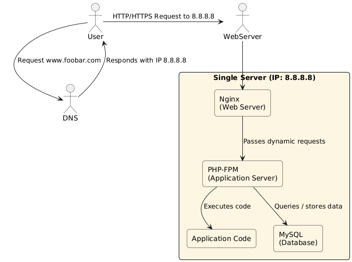

## Description
This diagram represents a simple LAMP-style web infrastructure hosted on a single server, reachable via www.foobar.com.

- Domain: foobar.com with an A record pointing www to 8.8.8.8
- Web server: Nginx
- App server: PHP
- Codebase hosted on the server
- MySQL database installed locally
- All components run on a single machine

## Link to diagram

## Key concepts
- Server: A computer that provides services to users
- Domain name: Human-readable address for accessing the site
- DNS record: A record for www.foobar.com
- Web server: Serves static files and passes dynamic requests to app server
- App server: Executes app logic, connects to database
- Database: Stores and manages application data
- Communication: Uses HTTP/HTTPS to serve requests and responses

## Limitations
- SPOF: One server = one failure brings the whole system down
- Maintenance causes downtime
- No scalability: limited to resources of a single machine