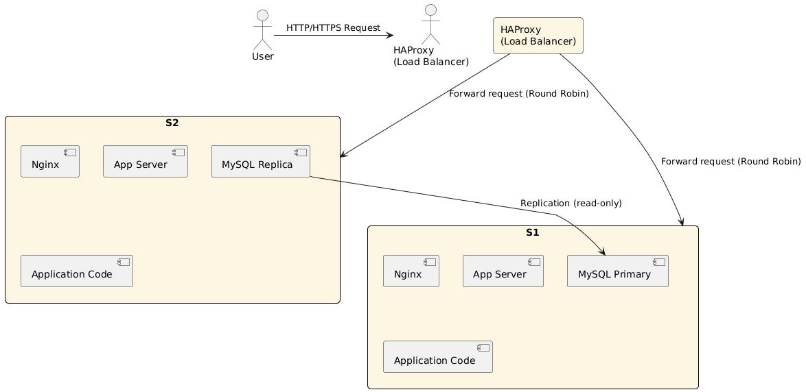

# 1-distributed_web_infrastructure

## Description

This is a distributed web infrastructure hosting www.foobar.com. It includes a load balancer, two web/app servers, and a MySQL primary-replica cluster.

## Components
- **HAProxy** as a Load Balancer (Active-Active, Round Robin)
- **2 Web Servers**, each running:
  - Nginx
  - App Server
  - Application code
  - MySQL (one Primary, one Replica)

## Diagram

## Key Concepts
- **Load Balancer**: Distributes traffic using Round Robin algorithm
- **Active-Active setup**: Both servers handle traffic simultaneously
- **MySQL Primary-Replica**: Primary handles writes, replica handles read-only sync
- **SPOF**: Load balancer is a single point of failure
- **Security**: No HTTPS or firewall
- **Monitoring**: No monitoring in place

## Limitations
- No redundancy for the load balancer
- No TLS (HTTPS) or firewall filtering
- No system monitoring or alerting