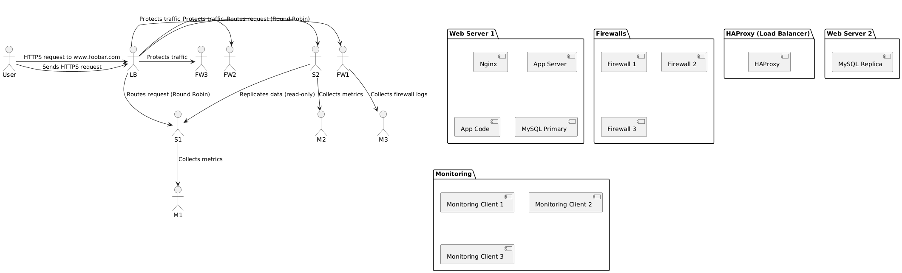

# 2. Secured and Monitored Web Infrastructure

## Description

This infrastructure is an improved version of the distributed setup. It adds security layers and monitoring tools to ensure confidentiality, integrity, and availability.

## Key Features

- 🔐 **HTTPS**: Website is served over SSL/TLS via HAProxy
- 🔥 **3 Firewalls**:
  - Firewall 1: Filters external traffic to HAProxy
  - Firewall 2: Filters internal traffic to web/app servers
  - Firewall 3: Filters traffic to database layer
- 📈 **Monitoring Agents**:
  - Installed on each server (e.g., using Sumo Logic, Prometheus Node Exporter)
  - Collect metrics, logs, and performance data
- 🧠 **SSL Termination**: Performed at the load balancer level
- 🗃️ **MySQL Replication**: One Primary, two Replicas (read-only)

## Diagram

---

## Why These Elements?

- **Firewalls**: Protect each layer from unauthorized access and reduce attack surface
- **HTTPS**: Encrypts data in transit, protects user credentials and sensitive info
- **Monitoring**: Alerts on resource usage, failures, traffic spikes, etc.
- **Monitoring tools** collect logs and metrics like:
  - CPU, RAM, disk
  - HTTP requests (including QPS)
  - DB performance
  - Custom app logs

## To Monitor QPS (Queries Per Second)

- Install monitoring on Nginx or HAProxy (via logs or status endpoint)
- Configure tools like Prometheus + Grafana or Sumo Logic to collect and visualize QPS over time

---

## Known Issues

- ⚠️ **SSL Termination at Load Balancer**: After the load balancer, traffic to web servers is unencrypted (mitigate with internal TLS)
- 🧨 **Single MySQL Write Node**: SPOF; if Primary goes down, writes fail
- 🧱 **All servers run all components**: Not scalable; difficult to maintain separation of concerns (app/database layers should ideally be split)

---