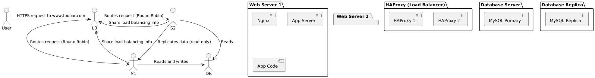

# 3. Scale Up

## Description

This infrastructure improves the performance and reliability of the system by splitting components (web server, application server, and database) across multiple servers. Additionally, it includes a load balancer for better traffic distribution, ensuring that the infrastructure can handle more traffic while maintaining high availability.

## Key Features

- ⚖️ **Load Balancer** (HAProxy): Distributes traffic between multiple web servers
- 🌐 **Web Servers**: Separate web servers handling HTTP requests, running the application, and interacting with the database
- 🗄️ **Database Servers**: Separate servers for the database, ensuring scalability and performance
- 🔄 **HAProxy Cluster**: Two load balancers configured to work as a cluster for improved availability

## Diagram

---

## Why These Elements?

- **Load Balancer (HAProxy)**: Ensures traffic is evenly distributed across multiple web servers, preventing a single server from becoming overwhelmed.
- **Web Servers**: Dedicated web servers handle HTTP requests, application logic, and database queries, improving performance and scalability.
- **Database Servers**: By separating the database from the web servers, we reduce the risk of bottlenecks and improve data handling.
- **HAProxy Cluster**: Using a cluster of load balancers ensures high availability—if one load balancer fails, the other takes over.

## To Scale Further

- **Add More Web Servers**: As traffic grows, additional web servers can be added. The load balancer will distribute requests evenly to all available servers.
- **Add More Database Servers**: You can add database replicas to offload read operations, improving the system’s ability to handle more queries.
- **Enhance Load Balancer**: You can introduce additional HAProxy nodes to handle more traffic and ensure redundancy.

---

## Known Issues

- ⚠️ **Single Point of Failure (SPOF) for MySQL**: If the primary MySQL server fails, writes are not possible. Adding MySQL replication or a failover solution can mitigate this issue.
- 🛑 **Load Balancer Clustering Overhead**: The configuration and synchronization of multiple load balancers may add complexity, though the benefits of high availability outweigh this.
- 🔄 **All Components on Separate Servers**: While separating the components improves scalability, it introduces more complexity in maintaining the infrastructure, especially for monitoring and backup management.

---

## Next Steps

To continue scaling the infrastructure, consider implementing:
- **Database Replication**: Implement MySQL replication to distribute read queries and increase availability.
- **Auto-Scaling**: Use cloud services like AWS or Azure to automatically scale web servers based on demand.
- **Monitoring**: Introduce monitoring solutions (e.g., Prometheus, Grafana, or Sumo Logic) to track performance and identify bottlenecks in the infrastructure.

---